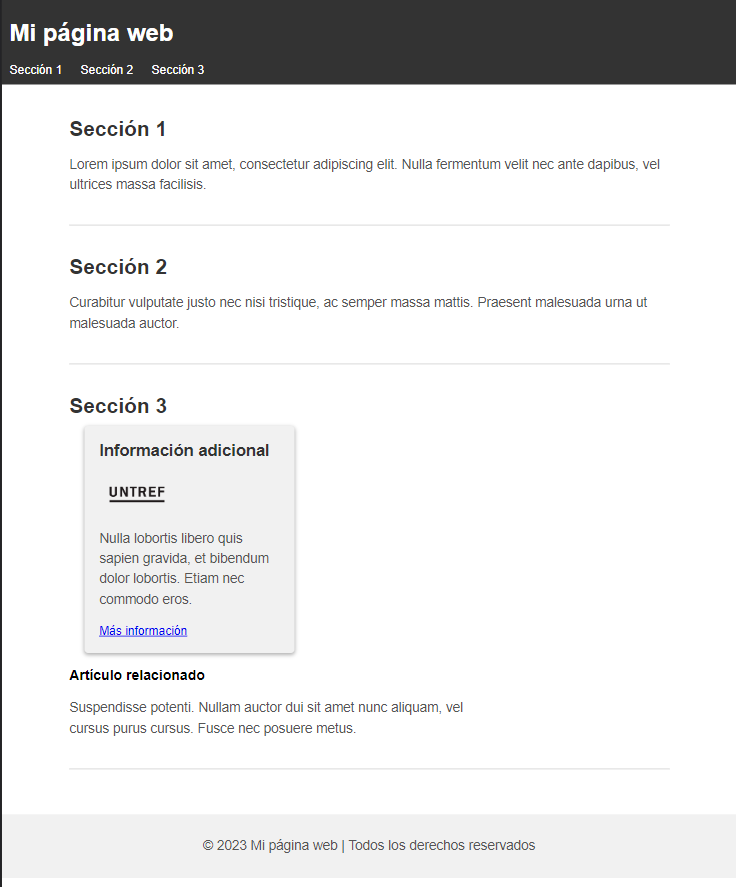
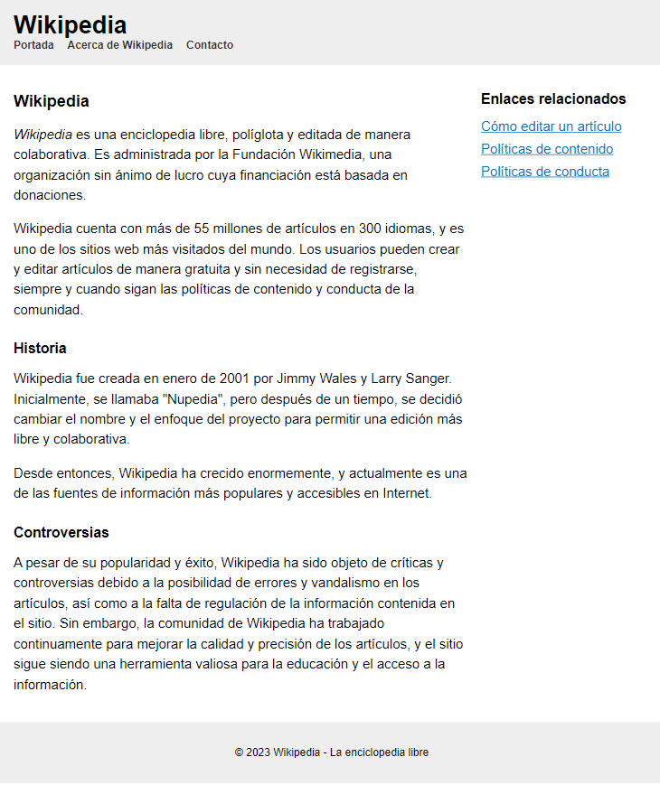

# Clase 7: Primera actividad

Para esta actividad los alumnos deberán trabajar todo lo aprendido en clase hasta la fecha.

Cada uno debe crear una página web utilizando **HTML semántico**.

La página debe incluir como mínimo:

- Un encabezado con el título de la página.
- Un menú de navegación con enlaces a diferentes secciones de la página.
- Dos o tres secciones principales, cada una con un título y un párrafo de texto explicativo.
- Una sección secundaria que contenga información adicional sobre el tema (por ejemplo, una galería de imágenes, un video, una infografía, etc.).
- Un pie de página con información sobre el autor o los autores de la página y una nota de derechos de autor (opcional).

