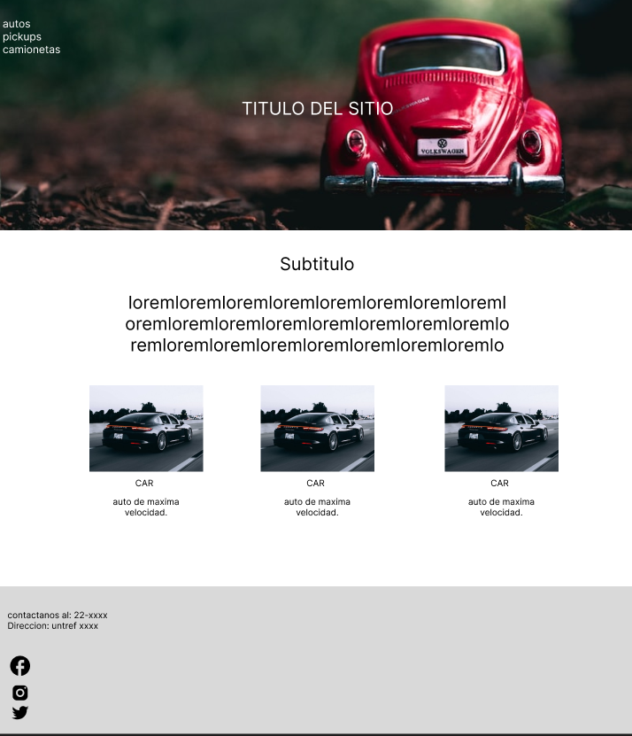

# Clase 13: Segunda Actividad

Es momento de practicar, todo lo visto hasta ahora.

Para esta actividad la idea es que puedan generar 2 archivos HTML que se puedan enlazar entre sí.

_En uno generar un index.html que posee:_

- Una barra de navegación, que posea un hover.
- Una sección con un banner y un título encima.
- Una sección con un título y un texto centrado.
- Una sección con el modelo de 3 cards.
- Un Footer que muestre logos de redes sociales y, por otro lado, que muestre información para contactarse con el sitio.

_En el otro HTML, generar:_

- Una barra de navegación.
- Un formulario que por detrás posee de fondo una imagen.
- Un footer totalmente idéntico al del index.html

Recuerda usar las propiedades CSS, que vimos hasta la fecha.

Utilizar pseudo clases cuando sea posible.

Utiliza box-model para separar los elementos.

Recuerda siempre el uso de las etiquetas semánticas y de agrupar el código en bloques.

**Te adjuntamos algunos recursos**

[Unplash](https://unsplash.com/es)

[Getwaves](https://getwaves.io/)

[Colorhunt](https://colorhunt.co/palettes/paste)
