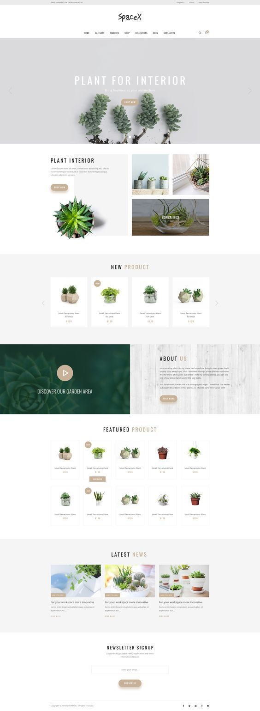

# Clase 13: Tercera Actividad

Llegó el momento de desplegar todos los conocimientos aprendidos hasta la fecha.

En esta actividad, **tendrán que analizar el mockup de la derecha y solamente maquetar lo que se muestra.**

Deberán, con todo lo visto hasta la fecha, definir:

- Qué técnica de maquetación es la ideal en cada caso, (Flexbox o grids).

- Llevar el diseño a código, (tengan en cuenta que tienen 2 horas no sean muy detallistas, simplemente esfuércense en que quede todo bien posicionado).

**Los recursos están en las carpetas _[recursos](./recursos)_**.
